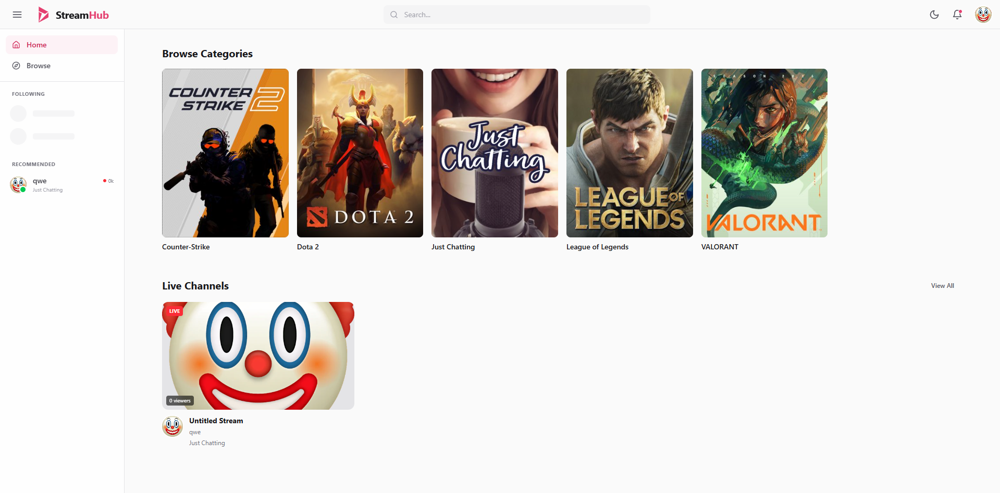
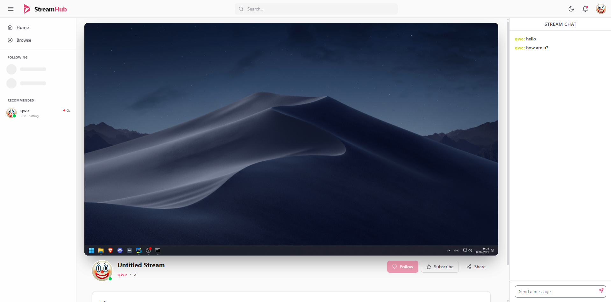
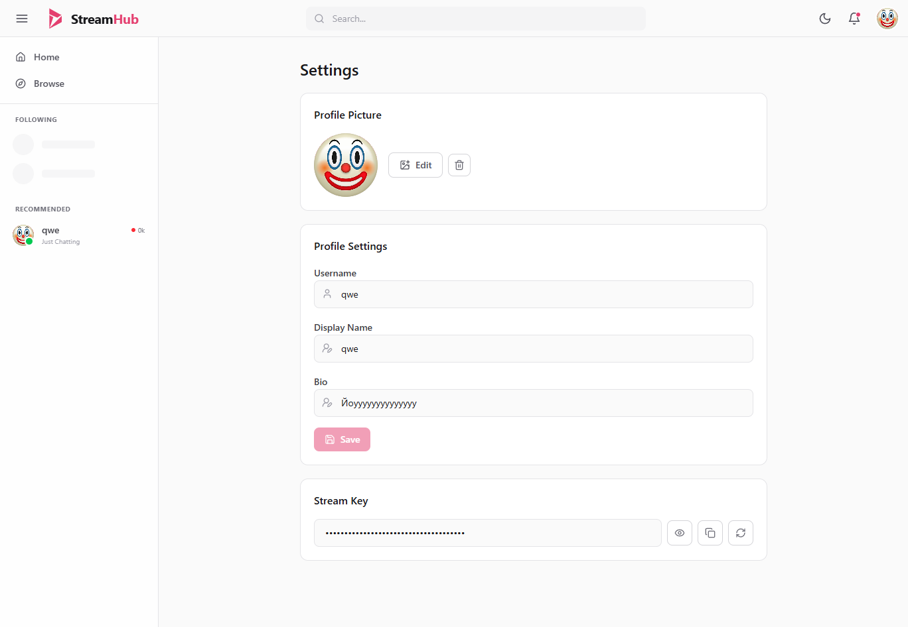

<h1 align="center">
  
  <span style="position: relative; top: -18px;">StreamHub</span>
</h1>

<p align="center">
  <b>Open-source live streaming platform</b><br />
  Realtime chat, edge delivery, and creator tools in one stack.
</p>

<p align="center">
  <a href="LICENSE">
    
  </a>
</p>

## Monorepo Structure

- `apps/frontend` - React + Vite web client
- `apps/backend` - NestJS API (Prisma, PostgreSQL, Redis, NATS, Scylla)
- `apps/backend/test` - backend unit tests grouped by domain
- `apps/edge` - Go edge service for realtime/WebSocket flow
- `apps/srs` - SRS config for RTMP/HLS
- `packages/shared` - shared models/contracts used across apps

## Tech Stack

- Frontend: React 19, Vite, TypeScript, Tailwind
- Backend: NestJS 11, Prisma 6, PostgreSQL
- Realtime/Infra: Redis, NATS, ScyllaDB, SRS
- Edge: Go 1.25
- Tooling: pnpm workspaces, Docker Compose

## Prerequisites

- Docker Desktop (or Docker Engine) with Compose
- Node.js 22 and pnpm 10.22.0 for local checks
- Git

## Quick Start (Docker)

1. Clone repository:

```bash
git clone git@github.com:kannoqwe/StreamHub.git
cd StreamHub
```

2. Create env file:

```bash
cp .env.example .env
```

3. Start all services:

```bash
docker compose up --build
```

4. Apply the Prisma schema to the local Postgres database:

```bash
docker compose exec backend npx prisma db push
```

This project does not run Prisma schema changes automatically on container start. Run this after creating a fresh database volume or after changing `apps/backend/prisma/schema.prisma`.

5. Open apps:

- Frontend: `http://localhost:5173`
- Backend API: `http://localhost:3000`
- Edge WS: `ws://localhost:8081/ws`
- SRS HTTP: `http://localhost:8080`

## Development Checks

Install dependencies:

```bash
pnpm install --frozen-lockfile
```

Generate Prisma client:

```bash
pnpm --filter @streamhub/api prisma:generate
```

Run backend unit tests:

```bash
pnpm --filter @streamhub/api exec jest --runInBand
```

Run backend checks:

```bash
pnpm --filter @streamhub/api lint
pnpm --filter @streamhub/api build
```

Run frontend checks:

```bash
pnpm --filter @streamhub/web lint
pnpm --filter @streamhub/web build
```

Run edge checks:

```bash
cd apps/edge
go test ./...
go build ./cmd/edge
```

Backend tests live in `apps/backend/test`, not beside production files in `src`. See `docs/testing.md` for the test layout and typing rules.

## Screenshots

### Home



### Stream



### Profile Settings



## Environment Variables

Use `.env.example` as a base and update values for your environment.

## Documentation

- `docs/testing.md` - backend test structure and typed mock rules.
- `docs/ci-cd.md` - GitHub Actions, image publishing, and deployment flow.

## License

This project is licensed under the MIT License. See `LICENSE`.
